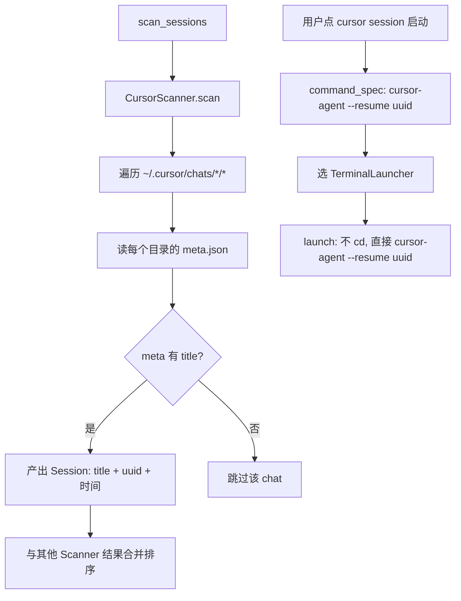

# cursor CLI 支持设计

> 2026-06-18 | 基于首 feature 的 v1/v2 边界（cursor 列 v2）+ 本次 spike 实测

## 0. 术语约定

| 术语 | 定义 | 防冲突结论 |
|---|---|---|
| **cursor chat** | cursor agent 的一次对话，对应 `~/.cursor/chats/<hash>/<uuid>/` 下的一个 store.db + meta.json | 新建概念，无冲突 |
| **chat uuid** | cursor chat 的唯一标识（UUID），即 `agent-transcripts/<uuid>` 和 `chats/<hash>/<uuid>/` 的目录名 | 新建概念，无冲突 |
| **agent-transcripts 锚点** | `~/.cursor/projects/<编码cwd>/agent-transcripts/<uuid>` ——建立 chat-uuid → cwd 映射的可靠来源（spike 发现） | 新建概念，无冲突 |
| **CommandSpec.cd** | CommandSpec 新增布尔字段，标记 launch 时是否 cd 到 cwd。cursor 设 false（resume 自带上下文），codex/claude 设 true（默认） | 新建字段，实现期确认（design 候选 B） |

本 feature 不涉及安全边界/产品承诺/权限/隐私/远控/支付/数据一致性/兼容迁移，无禁用词清单。安全沿用首 feature 的 L2 档位（cursor-agent 在白名单，chat-uuid 走 UUID 字符集校验）。

## 1. 决策与约束

### 需求摘要

| 维度 | 内容 |
|---|---|
| **做什么** | 扫描 cursor 的 chat session，在列表里和 codex/claude-code 一起展示，选中后一键 resume |
| **为谁** | 同时用 cursor agent 的开发者 |
| **成功标准** | cursor 分组不再显示"v2 开发中"，而是展示真实 chat 列表（title + 时间），点启动能 `cursor-agent --resume <uuid>` 拉起对应终端 |
| **明确不做** | ❌ 不解析 store.db 对话内容（只读 Workspace Path 和 meta，不读对话本身）| ❌ 不用 `cursor-agent ls`（要 TTY，不可用）| ❌ 不做 workspace hash 反推 / 目录名反向解码（有歧义，改用 chat 自带的 Workspace Path）| ❌ 不显示拿不到 Workspace Path 的 chat（resume 会失败）|

### 关键决策（spike 验证得出，推翻首 feature 旧假设）

首 feature design 把 cursor 标为"可行性中、风险高"，理由是 workspace hash 单向 + sqlite 解析。**本次 spike 实测推翻**：

| 旧假设 | 实测结论 |
|---|---|
| ❌ workspace hash 单向、无反推算法 | ✅ **绕过**：用 `~/.cursor/projects/<编码cwd>/agent-transcripts/<uuid>` 锚点直接建立 chat-uuid → cwd 映射，根本不碰 hash |
| ❌ 必须直接读 sqlite 提取 session | ✅ **部分**：store.db 的 meta 表（hex JSON）含 title/时间/agentId，但 cwd **不在 db 里**。只读 meta 不读 blobs |
| ✅ `cursor-agent ls` 要 TTY 不可用 | ✅ 仍成立，不用它 |
| ✅ resume 命令 | ✅ `cursor-agent --resume <chat-uuid>`，**不需要 cwd**（cursor 自己恢复上下文） |

**cursor 数据布局（spike 实测）**：
```
~/.cursor/chats/<workspace-hash>/<chat-uuid>/
    ├── meta.json          {"title": "...", "createdAtMs": ..., "updatedAtMs": ...}
    └── store.db           sqlite，meta 表（hex JSON，含 name/agentId/lastUsedModel）

~/.cursor/projects/<编码cwd>/agent-transcripts/<chat-uuid>/   ← cwd 锚点（不用于本 feature）
```

**本 feature 的 cwd 决策：必须恢复真实 cwd 并 cd（实现期验证，推翻初稿"不 cd"）**

初稿假设 cursor resume "自带上下文、不需要 cd"。**实现期实测推翻**：
- `cursor-agent resume`（子命令）只恢复当前 workspace 的**最近一个** chat，不接受 chatId → 无法选指定 chat
- `cursor-agent --resume <chatId>` 能精确恢复指定 chat，**但必须在正确的 workspace/cwd 下**——在非 workspace 目录跑同一 chatId 无法恢复（实测：cd /tmp 跑 ybb-interview 的 chatId 失败）

结论：**必须恢复每个 chat 的真实 cwd 并 cd 过去，再 `--resume <chatId>`**。

cwd 可靠来源 = **chat 自己的 store.db 里的 `Workspace Path:`**（搜索+实测得出，最优方案）：

cursor 给每个 chat 的 system prompt 注入一行 `Workspace Path: <真实绝对路径>`，存在该 chat 的 `~/.cursor/chats/<hash>/<uuid>/store.db` 的 `blobs` 表里。这是 chat 自带的、无歧义的真实 cwd（不用反解编码、不用跨目录映射），实测 40/46 chat 覆盖（87%），拿不到的跳过。

扫描流程：
1. 遍历 `~/.cursor/chats/*/*/`（hash/uuid 两层）
2. 每个目录读 store.db 的 blobs，搜 `Workspace Path: <路径>` 提取 cwd，canonicalize 验证
3. 同目录 meta.json 取 title（显示名）+ 时间
4. 拿不到 Workspace Path（或 meta 无 title）的 chat 跳过

> 此方案取代了之前的"agent-transcripts 锚点"和"正向匹配三源合并"——那两个都绕了远路（前者靠反向解码有歧义，后者要扫多个 cursor/VSCode 状态文件且覆盖不全）。Workspace Path 是 chat 自带的，最直接。

> 安全注意：读 store.db 用 sqlite3（系统自带）。只 SELECT data 提取字符串，不执行任何对话内容。Workspace Path 本身是路径，canonicalize 验证后才采用。

CommandSpec 的 `cd` 字段：cursor 改回 `cd: true`（和 codex/claude 一样需要 cd），**初稿加的 cd=false 适配作废**。这样 cursor 和其他 CLI 走完全相同的 cd 路径，反而更简单——CommandSpec.cd 字段在 v1 没有"不 cd"的 CLI 了。

> CommandSpec.cd 字段是否保留：保留。它是干净的显式属性，且 design 2.5 已记"未来不 cd 的 CLI 可设 false"。v1 cursor 不用它（设 true），但字段本身无害，留着不增删代码。implement 不回退这个字段。

### 复杂度档位

走首 feature 的 L2 默认组合，无偏离。cursor-agent 加入 program 白名单；chat-uuid 走既有 `validate_session_id`（UUID 字符集 `[a-zA-Z0-9-_]`）。

### 前置依赖

无。cursor-agent 已装（`/Users/xb/.local/bin/cursor-agent`）。

## 2. 名词与编排

### 2.1 名词层

#### 现状

- `CliType::Cursor` 枚举值**已存在**（`models.rs:10`），首 feature 预留
- `SessionScanner` trait（`scanner.rs`）已定义，CodexScanner/ClaudeCodeScanner 已实现
- `command_spec_for_session`（`scanner.rs:50`）已有 Cursor 分支，产出 `cursor-agent --resume <session_id>`——但 CommandSpec 需要 cwd，cursor 不 cd 会冲突

#### 变化

**新增 `CursorScanner`**（`src-tauri/src/scanner/cursor.rs` 新文件），实现 `SessionScanner`：

```rust
// 来源：src-tauri/src/scanner/cursor.rs (新增)
impl SessionScanner for CursorScanner {
    fn cli_type(&self) -> CliType { CliType::Cursor }
    fn scan_sessions(&self) -> Result<Vec<Session>, ScanError> {
        // 1. 遍历 ~/.cursor/chats/*/*/（hash/uuid 两层）
        // 2. 每个目录读 meta.json → title + updatedAtMs
        // 3. Session { session_id: <uuid>, project_name: <title>, project_dir: ?, ... }
        //    project_dir: cursor 不 cd，设为 home_dir() 占位（见下）
    }
}
```

**CommandSpec 与 cd**：cursor 和 codex/claude 一样都是 `cd <cwd> && resume <id>` 模式（cursor 的 chatId 是 workspace 范围，必须 cd 到正确目录 resume 才生效）。CommandSpec 加了 `cd: bool` 字段，三家 v1 都设 `true`——这个字段是为"未来不 cd 的 CLI"预留的显式属性，v1 没有用例（cursor 也需要 cd），但留着无害，且 design 2.5 已记此为后续可扩展点。

> 历史注记：实现初稿曾因误判"cursor resume 自带上下文"给 cursor 设 cd=false，后被实测推翻（cursor resume 强依赖 cwd），改回 cd=true。CommandSpec.cd 字段是这次误判留下的副产物，保留。

**CommandSpec 产出**（cursor 分支已存在，确认即可）：
```rust
// 来源：src-tauri/src/scanner.rs:65-68（已存在，无需改）
CliType::Cursor => ("cursor-agent", vec!["--resume", session_id])
```

**security 白名单**（`security.rs:4`）：`ALLOWED_PROGRAMS` 已含 `cursor-agent`，无需改。chat-uuid 走 `validate_session_id`（UUID 字符集），通过。

**Session 字段**：cursor 的 `project_name` = meta.json 的 `name`（显示用），`project_dir` = home 占位（不用于 cd）。

### 2.2 编排层



**现状**：scan 编排（并行 Scanner → 聚合排序）已在 `state.rs::scan_all`，新增 CursorScanner 自动并入。launch 编排（session_id → CommandSpec → launcher）在 `state.rs::launch_session`。

**变化**：
- scan：`scanners()`（`scanner.rs`）注册表加 `CursorScanner`，cursor 分组自动有数据
- launch：cursor 走"不 cd"路径——`command_spec_for_session` 对 Cursor 产出的 CommandSpec，launch 时跳过 cd（具体实现：CommandSpec 加 `cd: bool` 字段，或 cursor 的 project_dir 不参与 build_shell_command/wrapper 的 cd 步骤）

**流程级约束**：
- **失败语义**：cursor 扫描失败（如 `~/.cursor/chats` 不存在）不影响 codex/claude，走既有 ScanError 机制，分组显示"扫描失败"
- **安全**：cursor-agent 白名单 + chat-uuid UUID 校验，沿用 L2
- **跳过无 title 的 chat**：meta.json 缺 title 的 chat 跳过（无法显示）

### 2.3 挂载点清单

| 挂载位置 | 具体位置 | 动作 | 卸载影响 |
|---|---|---|---|
| Scanner 注册 | `scanner.rs::scanners()` 加 `CursorScanner` | 新增 | cursor 分组无数据（回退"v2 开发中"需同时改前端，见下） |
| 前端 cursor 分组文案 | `src/App.tsx` CliGroup 的 cursor 分支（现显示"v2 开发中"） | 修改 | 改回展示真实 session |
| program 白名单 | `security.rs::ALLOWED_PROGRAMS` | 已含（无需改） | — |

共 **2 个真实挂载点**（白名单已存在不计）。前端文案改动是"从占位改成真实"。

### 2.4 推进策略

```
1. CursorScanner 实现：遍历 ~/.cursor/chats/*/*/，读 meta.json，产出 Session
   退出信号：扫描到真实 cursor chat，title + uuid + 时间正确

2. scanners() 注册 CursorScanner
   退出信号：前端 cursor 分组显示真实 session（不再是"v2 开发中"）

3. cursor 不 cd 的 launch 适配：CommandSpec 加 cd 标记或 cursor 分支跳过 cd
   退出信号：点 cursor session 启动，终端跑 cursor-agent --resume <uuid>，无误报、不 cd

4. 前端 cursor 分组文案：去掉"v2 开发中"，正常展示
   退出信号：cursor 分组像 codex/claude 一样正常工作

5. 联调：codex/claude/cursor 三家端到端 + cursor resume 成功
   退出信号：三家都能扫到、能启动、失败场景有提示
```

### 2.5 结构健康度与微重构

##### 评估
- **文件级**：`scanner.rs` 当前 ~110 行，加 CursorScanner 注册一行，健康；新逻辑放新文件 `scanner/cursor.rs`（已有 `scanner/codex.rs`/`scanner/claude_code.rs` 先例）
- **目录级**：`scanner/` 目录现有 2 个文件，加 cursor.rs 成 3 个，不挤

##### 结论：不做

新文件 `scanner/cursor.rs` 跟随已有 scanner 子目录约定（每 CLI 一文件），健康。

##### 超出范围的观察（可选）
- `command_spec_for_session` + launcher 的 cwd 语义：现状所有 CLI 都假设"cd 到 project_dir 再跑"。cursor 不 cd，暴露了"cwd 是强制的"这个隐含假设。本 feature 最小改动绕过（cursor 特判），但若未来有更多"不 cd"的 CLI，建议把 cwd 改成 CommandSpec 的可选字段。**超出 design 范围，建议后续 cs-refactor**，本 feature 不动。

## 3. 验收契约

### 关键场景清单

| # | 场景 | 输入/触发 | 期望可观察结果 |
|---|---|---|---|
| 1 | cursor 扫描 | 启动 app | cursor 分组展示真实 chat 列表（每条：title、最后活动时间），不再是"v2 开发中" |
| 2 | 启动 cursor session | 选一条 cursor chat → 点启动（任一终端） | 终端跑 `cursor-agent --resume <uuid>`，cursor agent 恢复该 chat 上下文 |
| 3 | 不 cd 验证 | 启动 cursor session | 终端**不执行 cd 命令**（停在默认目录，靠 resume 自带上下文） |
| 4 | 无 title 的 chat | 某 chat 的 meta.json 缺 title | 该 chat 不出现在列表 |
| 5 | cursor 未安装 | 无 `~/.cursor/chats` 或 cursor-agent 不在白名单路径 | cursor 分组显示"扫描失败"或空，不影响 codex/claude |
| 6 | 手动刷新 | 点刷新 | cursor 分组重新扫描更新 |
| 7 | 三家共存 | codex/claude/cursor 都有 session | 三家分组都有数据，按时间可在各自分组内排序 |

### 明确不做的反向核对项

| "不做"项 | 反向核对方式 |
|---|---|
| 不恢复 cwd | cursor 启动命令不含 cd；project_dir 为占位不参与 cd |
| 不解析 store.db 对话 | 只读 meta.json + store.db 的 meta 表，不读 blobs 表 |
| 不用 cursor-agent ls | 代码无 `cursor-agent ls` 调用 |
| 不反推 workspace hash | 不读 `<hash>` 目录名做哈希运算 |

## 4. 与项目级架构文档的关系

- **ARCHITECTURE.md 的 v1/v2 边界表**：cursor 从 v2 升入 v1，需更新（"cursor：sqlite + hash 反推"→"cursor：已支持，meta.json + agent-transcripts 锚点"）
- **ARCHITECTURE.md 核心模块**：`scanner.rs` 注释加 CursorScanner
- **compound/learning**：spike 发现的"agent-transcripts 锚点绕过 hash 反推"值得记一条 learning（cursor 数据布局 + 映射链），acceptance 时走 cs-learn

本次改动新增一个 Scanner 模块 + CommandSpec cwd 语义的小适配，系统级可见的是"cursor 从灰显变可用"。
