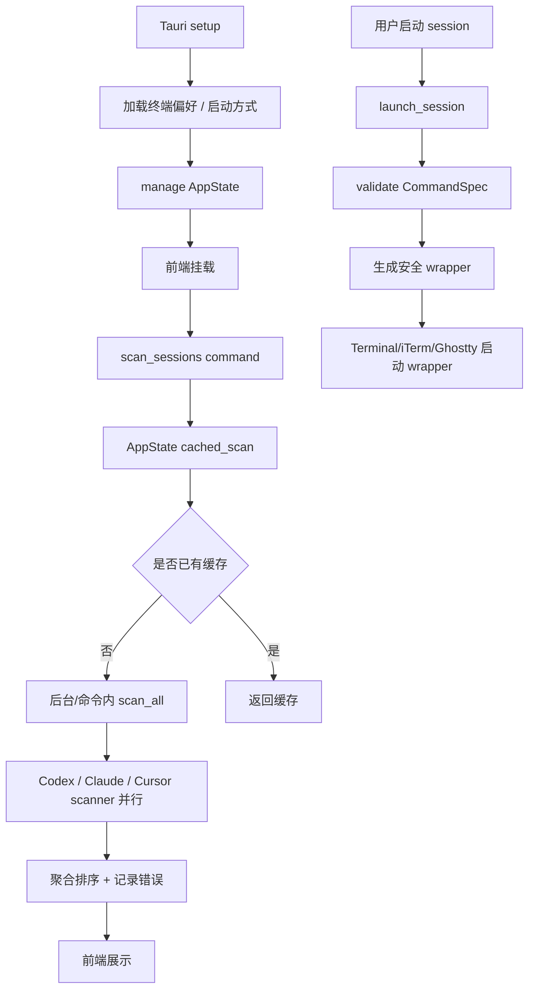

# audit-p1-p2-remediation 设计文档

## 0. 术语约定

| 术语 | 定义 | 防冲突结论 |
|---|---|---|
| 审计整改 | 针对 `.codestable/audits/2026-06-19-fullstack-audit/` 中 P1/P2 finding 的一次收敛实现 | 新建 feature 名词，不替代 audit 文档 |
| 扫描启动解耦 | App 初始化只装载状态与偏好，不在 Tauri `setup` 阶段同步等待全量 session 扫描 | 对应 audit finding-01 |
| Scanner fixture | scanner 单测使用的临时目录 / 临时数据库 / 最小 jsonl 数据，而不是用户真实 `$HOME` 数据 | 对应 audit finding-03 |
| 安全启动脚本 | 由后端生成、权限收紧、路径受控的临时 wrapper；终端 AppleScript 只负责启动 wrapper，不再直接注入完整 shell 命令 | 复用 Ghostty wrapper 的既有方向，对应 audit finding-05 |
| 前端界面模块 | 从 `App.tsx` 拆出的 Toolbar / AgentGroup / ProjectBucket / SessionRow / Skeleton / icon 等展示和交互单元 | 对应 audit finding-04 |

### 术语守护清单

- 禁用短语：`cursor 不 cd`、`cursor resume 不校验 cwd`、`project_dir 是占位`
- 允许保留：历史 design / audit / learning 中用于说明旧语义的文字可以保留，但必须有“旧语义 / 历史 / 曾经”上下文。
- acceptance grep 范围：`src-tauri/src/`、`.codestable/architecture/`、`.codestable/features/2026-06-19-audit-p1-p2-remediation/`。
- 命中分类规则：源码注释和当前架构描述命中必须修；历史文档命中可保留；本 feature 文档命中必须明确标注为“禁用旧语义”。

## 1. 决策与约束

### 需求摘要

用户目标：把刚完成的全栈审计里所有 P1/P2 发现转成一组可实施整改，优先解决用户体感和维护风险。

核心行为：

- App 启动不再被全量扫描阻塞，前端仍能通过现有命令加载 / 刷新 session。
- Cursor 扫描不再对每个 chat 启动一次 `sqlite3` 子进程。
- scanner 单测不依赖开发者本机真实 Codex / Claude / Cursor 数据。
- 前端主界面按职责拆分，保持现有视觉和交互语义。
- Terminal/iTerm 启动链路减少 shell 字符串暴露面。
- `cd=false / cursor resume` 旧注释被清理，当前“三家都 cd”的架构语义一致。
- Codex 简介扫描不再固定死在前 64 行。
- Tauri CSP 从 `null` 收敛到最小可用策略。

成功标准：

- audit finding-01 到 finding-08 都有对应代码或配置收敛。
- `cargo test --lib` 和 `pnpm build` 通过。
- 新增 / 调整的 scanner 测试在无真实 `$HOME/.codex`、`$HOME/.claude`、`$HOME/.cursor` 数据时仍能验证解析逻辑。
- 前端拆分后用户可见布局、筛选、折叠、启动、状态提示不回退。

明确不做：

- 不新增新的 CLI agent 类型，不改变 `Session` 对外 JSON 字段。
- 不做 Windows / Linux 终端启动支持。
- 不重做视觉风格，不把这次整改扩展成新的 UI 改版。
- 不引入远程服务、网络同步或 session 持久化。
- 不修改历史 audit / learning 的事实记录，只修当前代码、架构文档和本 feature 产物。

### 复杂度档位

走本地桌面工具默认档位，但有两个偏离：

- 安全边界 = 收紧（偏离默认“内部工具低风险”的原因：Terminal/iTerm 启动链路会靠近本地命令执行边界）。
- 测试可靠性 = 强制 fixture（偏离默认“本机 smoke 可接受”的原因：scanner 解析格式变化是核心能力，不能依赖用户真实历史数据验证）。

### 关键决策

1. **整改拆成四条并行 lane，而不是一个大重写**  
   扫描启动、scanner 解析与测试、前端拆分、安全配置互相耦合低；按 lane 实施能逐步验证，避免一次性大改导致问题定位困难。

2. **扫描入口保持 Tauri command 契约不变**  
   前端仍调用 `scan_sessions` / `refresh_sessions` 并接收 `ScanResponse`。变化只发生在 setup 是否预扫、scanner 内部如何读数据、测试如何注入数据源。

3. **Terminal/iTerm 安全收敛复用 wrapper 思路**  
   Ghostty 已经通过 wrapper 规避多词命令和 PATH 问题；Terminal/iTerm 不强行追求“参数化 AppleScript 执行命令”，而是把 AppleScript 责任缩小为启动受控 wrapper。

4. **前端先做“只搬不改行为”的组件拆分**  
   UI 结构整改本身就是 P1，但第一步必须可由 `pnpm build` 和人工 smoke 证明行为不变，避免把视觉改版混入结构治理。

## 2. 名词与编排

### 2.1 名词层

#### 现状

- `Session` / `ScanResponse` / `CliScanError` 定义在 `src-tauri/src/models.rs` 与 `src/types.ts`，前后端契约已稳定。
- `AppState` 在 `src-tauri/src/state.rs` 同时承担 session 缓存、扫描编排、终端偏好和启动偏好。
- `SessionScanner` trait 在 `src-tauri/src/scanner.rs`，各 CLI scanner 默认从真实 `$HOME` 推导数据根目录。
- `CursorScanner` 在 `src-tauri/src/scanner/cursor.rs` 通过外部 `sqlite3` 命令读取 `store.db`。
- `TerminalLauncher` 在 `src-tauri/src/launcher.rs`，Ghostty 已有 wrapper，Terminal/iTerm 仍使用 `build_shell_command` 后注入 AppleScript。
- 前端 `src/App.tsx` 同时包含 icon、toolbar、分组、会话行、状态和 Tauri command 调用；`src/App.css` 集中所有样式。

#### 变化

- **新增 / 调整 scanner 数据源抽象**：每个 scanner 保留默认 `$HOME` 行为，同时暴露测试可注入的数据根目录，供 fixture 单测使用。
- **新增 Cursor workspace 读取节点**：把“从 store.db 提取 Workspace Path”从“每 chat 一个 `sqlite3` 子进程”改为进程内 SQLite 读取或可复用读取器；接口语义仍返回 canonicalized cwd。
- **新增安全 wrapper 共享名词**：把“生成可执行 wrapper 脚本”从 Ghostty 私有实现提升为 launcher 内部可复用能力，Terminal/iTerm/Ghostty 都能复用命令构造。
- **前端组件名词拆分**：引入 `components/Toolbar`、`components/AgentGroup`、`components/ProjectBucket`、`components/SessionRow`、`components/Skeleton`、`components/icons`；状态编排仍归 `App` 或轻量 hook。
- **配置名词收敛**：`tauri.conf.json` 的 `app.security.csp` 从 `null` 变为最小 CSP 字符串。

#### 接口示例

```rust
// 来源：src-tauri/src/scanner.rs SessionScanner 既有契约，保持不变
pub trait SessionScanner: Send + Sync {
    fn cli_type(&self) -> CliType;
    fn scan_sessions(&self) -> Result<Vec<Session>, ScanError>;
}

// 来源：scanner 测试支撑，新增/调整为实现自决的数据源注入形态
let scanner = CursorScanner::with_root(temp_home.join(".cursor/chats"));
let sessions = scanner.scan_sessions()?;
```

```tsx
// 来源：src/App.tsx 现有组件拆分后的 props 形态，保持展示数据来源不变
<AgentGroup
  cliType="codex"
  sessions={sessionsByCli.get("codex") ?? []}
  launchingId={launchingId}
  onLaunch={handleLaunch}
/>
```

```json
// 来源：src-tauri/tauri.conf.json app.security.csp
{
  "app": {
    "security": {
      "csp": "default-src 'self'; img-src 'self' asset: http://asset.localhost; style-src 'self' 'unsafe-inline'"
    }
  }
}
```

### 2.2 编排层



#### 现状

- 启动流程：`src-tauri/src/lib.rs::run` 的 `setup` 中创建 `AppState` 后立即 `state.scan_all()?`，扫描完成后才 `app.manage(state)`。
- 扫描流程：`state.rs::scan_all` 创建所有 scanner，`thread::spawn` 并行，主线程 `join` 等待最慢 scanner。
- Cursor 流程：`cursor.rs::scan_sessions` 遍历每个 chat，调用 `extract_workspace_path`，后者每次 `Command::new("sqlite3")`。
- 启动 session 流程：`state.rs::launch_session` 找 session → `command_spec_for_session` → `launcher.launch`；Terminal/iTerm 构造 shell 字符串并注入 AppleScript。
- 前端流程：`App` mount 后依次 `loadTerminals`、`loadSessions`；render 阶段计算 recent filter 和 CLI group。

#### 变化

- 启动流程变化：Tauri setup 只加载偏好、校正不可用终端、注册 state；不执行全量扫描。首次 session 加载由前端 `scan_sessions` 触发。
- 扫描流程变化：`cached_scan` 仍保持“未扫描则触发 scan_all”的语义；必要时可以增加显式 `scanning` 状态防止重复刷新并发，但不改变前端 command 名称。
- Cursor 流程变化：workspace path 提取不再依赖每个 chat 一个外部进程；读取节点返回 `Option<PathBuf>`，失败仍跳过无法恢复的 chat。
- 测试流程变化：scanner 测试不再读用户真实目录；用 fixture 构造最小 jsonl / meta.json / store.db，验证解析、summary、cwd、排序和边界。
- Launcher 流程变化：Terminal/iTerm launch 前也生成 wrapper；AppleScript `do script` / `write text` 只注入 wrapper 路径或执行 wrapper 的短命令。
- 前端流程变化：组件拆分后，`App` 只保留数据加载、状态派发和顶层布局；显示和局部交互下沉到组件。

#### 流程级约束

- 扫描错误仍以 `CliScanError` 返回，不因为某个 CLI 失败而阻断其他 CLI 展示。
- `refresh_sessions` 仍必须强制重新扫描，不读取旧缓存。
- Cursor chat 缺少可验证 cwd 时继续跳过，不能用猜测路径 fallback。
- Terminal/iTerm wrapper 必须复用现有 `validate_command_spec`、`validate_session_id`、`shell_escape` 防护；不得新增未校验 shell 拼接入口。
- 前端拆分期间用户可见文案、按钮行为、ARIA、折叠默认展开、最近天数过滤默认值保持不变。
- CSP 收敛不能破坏 Vite/Tauri production build；dev 模式若需要额外放宽，必须只影响 dev。

### 2.3 挂载点清单

| 挂载位置 | 动作 | 删除后效果 |
|---|---|---|
| Tauri setup 初始化：`src-tauri/src/lib.rs::run` | 修改：移除 setup 阶段预扫描 | App 启动阻塞整改消失 |
| Scanner 注册与数据源：`src-tauri/src/scanner.rs` / `scanner/*` | 修改：scanner 支持 fixture 数据源，Cursor 读取节点替换 | 扫描性能与测试可靠性整改消失 |
| Launcher 实现：`src-tauri/src/launcher.rs` | 修改：Terminal/iTerm 复用安全 wrapper | shell 字符串安全收敛消失 |
| 前端入口：`src/App.tsx` | 修改：只保留顶层编排，组件挂到 `src/components/*` | 前端单体化整改消失 |
| Tauri 配置：`src-tauri/tauri.conf.json` | 修改：设置最小 CSP | CSP 安全整改消失 |

### 2.4 推进策略

1. **微重构骨架：前端只搬不改行为地拆组件 / 样式**  
   退出信号：`pnpm build` 通过；主界面仍能展示 toolbar、分组、项目折叠、会话行和状态提示。

2. **启动编排：移除 Tauri setup 同步扫描**  
   退出信号：AppState 初始化不调用全量 scanner；首次 `scan_sessions` 仍返回与原来等价的 `ScanResponse`。

3. **scanner 数据源与 fixture：让测试脱离真实 `$HOME`**  
   退出信号：Codex / Claude / Cursor scanner 单测全部使用临时 fixture，删除“路径不存在就 return”的假跳过。

4. **Cursor 读取节点：替换每 chat 一个 `sqlite3` 子进程**  
   退出信号：Cursor workspace path fixture 测试通过，代码中不再出现循环内 `Command::new("sqlite3")`。

5. **摘要与注释收敛：修 Codex 64 行边界和 cd=false 旧语义**  
   退出信号：Codex 真实用户消息位于 64 行后仍能提取；源码当前注释不再表达“cursor 不 cd”。

6. **Launcher 安全收敛：Terminal/iTerm 使用 wrapper 启动**  
   退出信号：Terminal/iTerm/Ghostty 三条 launcher 单测覆盖 wrapper 内容和 AppleScript 注入形态；`cargo test --lib` 通过。

7. **CSP 与全链路验证**  
   退出信号：`pnpm build`、`cargo test --lib` 通过；Tauri dev 或等效 smoke 能正常加载页面、扫描、启动 session。

### 2.5 结构健康度与微重构

##### convention 检索

已执行：

```bash
python3 .codestable/tools/search-yaml.py --dir .codestable/compound \
  --query "目录组织 OR 命名 OR 归属 OR convention"
```

结果：未命中已有目录组织 / 文件归属 convention。

##### 评估

- 文件级 — `src/App.tsx`：737 行；混合 icon、toolbar、session list、project bucket、agent group、状态加载和 Tauri command 调用；本次若继续追加会扩大单体化。
- 文件级 — `src/App.css`：1110 行；混合全局布局、控件、列表、骨架屏、状态、响应式；组件拆分后样式仍需同步拆分或至少按组件边界重组。
- 文件级 — `src-tauri/src/launcher.rs`：430 行；已承载三种终端、wrapper、AppleScript 生成和测试；本次要改 Terminal/iTerm 安全链路，属于同一职责延伸，但需避免再扩大无关职责。
- 文件级 — `src-tauri/src/scanner/cursor.rs`：170 行；本次改 workspace path 读取节点，职责仍聚焦 Cursor scanner。
- 目录级 — `src/`：当前只有少量文件但前端所有业务都堆在根目录；本次新增组件 / hook 不应继续平铺根目录。
- 目录级 — `src-tauri/src/scanner/`：当前每 CLI 一文件，目录健康；本次继续沿用该模式。

##### 结论：微重构（拆文件）

前端拆分是本 feature 的第一步，并且只搬不改行为：

- 搬什么：从 `App.tsx` 搬出 icon、toolbar 控件、AgentGroup、ProjectBucket、SessionRow、Skeleton；从 `App.css` 按组件边界搬出样式。
- 搬到哪：`src/components/`、`src/components/icons/`、`src/hooks/` 或 `src/lib/`。命名以当前 UI 名词为准，不新造抽象层。
- 行为不变怎么验证：`pnpm build` 通过；人工 smoke 核对最近天数筛选、agent 折叠、项目折叠、启动按钮、状态提示。
- 步骤序列：
  1. 先搬纯展示组件和 icon，不改 props 含义。
  2. 再搬 toolbar 控件，保持 state 仍由 App 持有。
  3. 最后按组件边界拆样式，保持 className 与 data attribute 语义。

##### 建议沉淀的 convention

- 是否稳定模式：稳定模式。
- 规则一句话：前端业务组件放 `src/components/`，跨组件纯函数放 `src/lib/`，状态编排 hook 放 `src/hooks/`，根目录只保留入口和顶层 App。
- 适用范围：frontend。
- 建议 implement 跑通后走 `cs-decide` 归档为 `category: convention`。

##### 超出范围的观察

- `src-tauri/src/launcher.rs` 长期会继续增长。若未来新增 Windows / Linux launcher，建议单独走 `cs-refactor` 按 terminal 拆文件；本 feature 只收敛现有安全债务，不做跨平台模块拆分。

## 3. 验收契约

### 关键场景清单

1. **启动不阻塞扫描**：启动应用 → Tauri setup 完成时不执行全量 scanner；前端首次调用 `scan_sessions` 后仍能展示 session。
2. **刷新仍强制扫描**：用户点击刷新 → `refresh_sessions` 触发重新扫描，返回最新 session 和 scan_errors。
3. **Cursor 大量 chat 扫描**：fixture 中包含多个 chat → workspace path 提取不通过“每 chat 一个 sqlite3 子进程”，且能提取有效 cwd。
4. **scanner 测试无本机依赖**：在没有真实 `$HOME/.codex` / `.claude` / `.cursor` 数据的环境中 → scanner 解析测试仍覆盖 codex、claude、cursor 三类 fixture。
5. **Codex 64 行边界**：Codex jsonl 前 64 行都是注入上下文，第 65 行后出现真实用户消息 → `summary` 取真实用户消息而非回退项目名。
6. **cd 语义一致**：Codex / Claude / Cursor 生成的 `CommandSpec` → `cd` 均为 true，源码当前注释不再暗示 cursor 不 cd。
7. **Terminal/iTerm 安全 wrapper**：选择 Terminal 或 iTerm 启动 session → wrapper 负责 `cd && exec program args`，AppleScript 不直接注入完整业务命令字符串。
8. **前端行为保持**：最近天数筛选、agent 折叠、工作目录折叠、启动按钮 loading、扫描错误展示 → 拆分后行为与整改前一致。
9. **CSP 生效且不破坏构建**：`tauri.conf.json` 不再是 `"csp": null`；`pnpm build` 通过，页面资源正常加载。

### 明确不做的反向核对项

- `src-tauri/src/models.rs` / `src/types.ts` 不新增新的 CLI 类型或破坏 `SessionData` 字段名。
- `src-tauri/src/` 不新增 Windows / Linux launcher。
- `src/` 不引入新的视觉主题、营销页、远程同步入口。
- 代码中不新增网络请求能力来解决扫描性能问题。
- 历史 audit / learning 文档不被改写为“从未存在问题”。

### 禁用词 grep

验收时执行：

```bash
rg -n "cursor 不 cd|cursor resume 不校验 cwd|project_dir 是占位" \
  src-tauri/src .codestable/architecture .codestable/features/2026-06-19-audit-p1-p2-remediation
```

要求：源码和当前架构文档无命中；本 feature 文档若命中，只能出现在术语守护或验收说明中。

## 4. 与项目级架构文档的关系

需要在 acceptance 阶段回写 / 更新 `.codestable/architecture/ARCHITECTURE.md`：

- 数据流：启动阶段不再描述为“app 启动即同步扫描”；应改成“前端首次加载 / 用户刷新触发扫描，AppState 缓存结果”。
- 安全口径：Terminal/iTerm 若完成 wrapper 收敛，应移除“shell 字符串拼接 warn”或改成历史说明。
- CLI 覆盖：保持“三家都是 cd <cwd> && resume <id>”语义，清理历史 cursor 不 cd 残留。
- 核心模块：如果前端组件目录被稳定拆分，可把 `src/` 描述从单个 App 更新为 App + components/hooks/lib 的轻量结构。

纯测试 fixture 的内部重构无需写入架构文档，但可以在 acceptance 中记录为测试可靠性改进。
