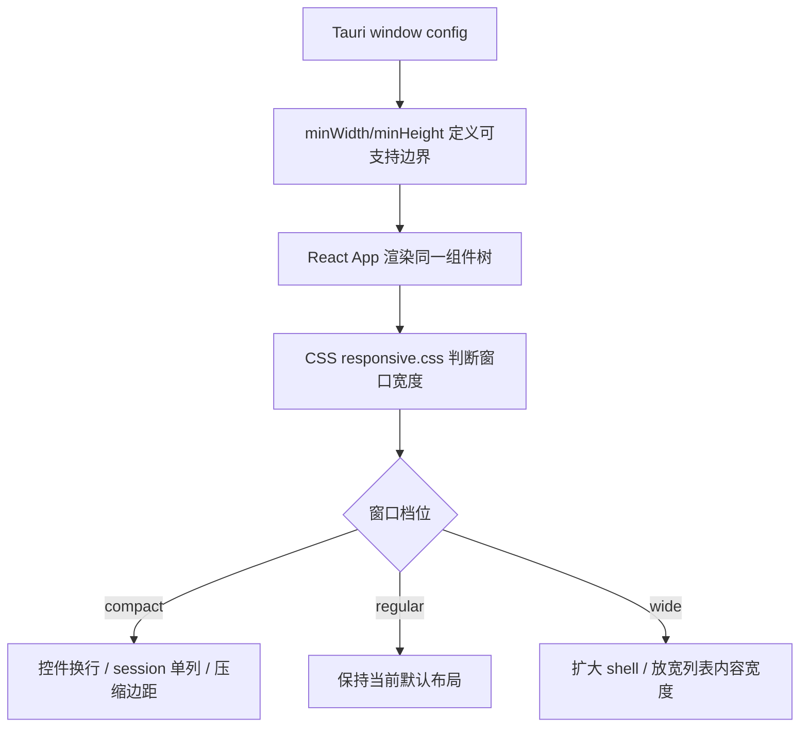

# responsive-window-ui 设计文档

## 0. 术语约定

| 术语 | 定义 | 防冲突结论 |
|---|---|---|
| 响应式窗口 UI | 同一套桌面界面在不同 Tauri 窗口宽高下自动调整布局密度、换行和滚动边界 | 新 feature 名词，不新增数据模型 |
| compact 窗口 | 约 360-559px 宽，用户把 app 缩窄到类似侧边工具窗口 | 复用现有 `@media (max-width: 560px)`，但补齐高度和控件命中区 |
| regular 窗口 | 默认 800x600 左右，是当前主设计目标 | 维持当前视觉密度和层级 |
| wide 窗口 | 约 900px 以上，用户拉宽 app 时避免主体仍被固定在 720px 造成浪费 | 新增宽屏布局约束，不改业务流程 |
| 可视安全区 | 内容不贴边、不被底部/顶部裁切，并保证操作控件不重叠的区域 | CSS 布局约束，不是 Tauri 权限概念 |

## 1. 决策与约束

### 需求摘要

用户目标：app 适配不同窗口，窗口变窄或变宽时 UI 仍然可读、可点、无重叠。

核心行为：

- 默认窗口仍保持当前 Session Launcher 的工作台式界面。
- 窄窗口下，标题、控制栏、agent header、session 行自动换行或压缩，不横向溢出。
- 宽窗口下，内容区域利用更多横向空间，避免列表长期锁死在 720px。
- Tauri 主窗口声明合理最小尺寸，防止用户缩到布局无法表达的宽高。

成功标准：

- 在 360x520、560x600、800x600、1100x720 四个窗口尺寸下，页面无横向滚动、无文字压到按钮、无控件重叠。
- `pnpm build` 通过。
- Tauri dev 或生产 app 中手动调整窗口时，控制栏、agent 分组、项目桶和 session 行保持可操作。

明确不做：

- 不改扫描、启动、偏好持久化和 Rust 后端业务逻辑。
- 不做移动端网页适配，不引入浏览器路由或独立 mobile 页面。
- 不改变主题选择的控件形态，不重新做视觉风格。
- 不新增新 agent、不改变 session 展示字段含义。
- 不把宽屏改成复杂 dashboard；只让现有列表在宽窗口更合理。

### 假设

- 假设最小可支持宽度定为 360px；比 360px 更窄的窗口通过 Tauri `minWidth` 阻止。
- 假设最小可支持高度定为 420px；高度不足时页面纵向滚动，而不是压缩内容。
- 假设宽屏断点从 900px 左右开始；该值可在 review 时调整。

### 复杂度档位

走本地桌面工具默认档位：

- 健壮性 L2：处理正常 resize 和极端窄窗口，不为非法 DOM 状态增加复杂保护。
- 结构 modules：沿现有 `components/` + `styles/` 边界扩展，不新建布局框架。
- 性能 reasonable：纯 CSS / 少量配置调整，不引入 resize observer 或运行时测量。
- 可读性 team：断点命名和窗口尺寸契约写清楚，半年后能继续维护。

### 关键决策

1. **优先用 CSS 断点和现有组件结构解决**
   这次是布局适配，不是数据编排变化。状态仍在 `App`，组件仍按 agent / project / session 展示。

2. **Tauri 最小窗口尺寸是布局契约的一部分**
   只靠 CSS 兜底会允许用户把窗口缩到不可用尺寸。应在 `tauri.conf.json` 增加 `minWidth` / `minHeight`，让 UI 有可验证边界。

3. **宽屏只提高信息承载，不改变层级**
   agent 仍纵向排列；宽屏优先扩大 shell 宽度，并允许展开后的 project bucket 更舒展。避免把三类 agent 平铺成三列，因为那会改变扫描阅读顺序。

## 2. 名词与编排

### 2.1 名词层

#### 现状

- Tauri 窗口配置在 `src-tauri/tauri.conf.json`，当前只有 `width: 800`、`height: 600`，无 `minWidth` / `minHeight`。
- 顶层 shell 在 `src/styles/base.css`：`.app-shell` 固定 `max-width: 720px`，宽窗口会浪费横向空间。
- 控制栏在 `src/styles/controls.css`：`.control-bar` 是 flex row；现有响应式只在 560px 以下 `flex-wrap`。
- 列表结构在 `src/styles/session-list.css`：agent header、project header、session row 有若干固定高度/间距；session 行是 `grid-template-columns: minmax(0, 1fr) auto`。
- 响应式集中在 `src/styles/responsive.css`，目前只有一个 `@media (max-width: 560px)` 和 reduced motion 规则。

#### 变化

- **新增窗口尺寸契约**：Tauri 配置补 `minWidth` / `minHeight`，默认 800x600 保持不变。
- **新增断点语义**：把响应式 CSS 按 compact / regular / wide 三档组织；regular 继续承载当前默认行为。
- **调整 app shell**：由固定 720px 上限改为 `min()` / `clamp()` 类策略，让 compact 不贴边、wide 可扩展到约 1040px。
- **调整控制栏编排**：compact 下控件按两行或多行稳定排布，菜单和 segmented control 有最小可点高度；regular/wide 保持单行优先。
- **调整列表密度**：compact 下 agent header 和 session row 更适合单列阅读；wide 下展开内容允许更宽的文本区域，必要时项目桶可用 grid 自动列。

#### 窗口适配示例

| 输入窗口 | 期望布局 |
|---|---|
| 360x520 | app shell 小边距；控制栏换行；agent header 统计块换到下一行；session 行中文案和时间上下排列；启动按钮仍可点击 |
| 560x600 | 接近当前小窗口规则；控制栏不横向溢出；列表卡片保持单列 |
| 800x600 | 当前默认视觉基本不变 |
| 1100x720 | shell 不再锁死 720px；展开 agent 后项目桶/列表利用更宽空间，长路径和简介更少截断 |

### 2.2 编排层



#### 现状

- Tauri 层不限制最小窗口，用户可以缩到小于 UI 可表达宽度。
- React 层不感知窗口宽度，所有适配都由 CSS 完成。
- CSS 只有 compact-like 的 `max-width: 560px` 规则；宽窗口没有专门规则。

#### 变化

- Tauri 层先设定最小窗口边界，防止不可用窗口尺寸进入 UI。
- React 层仍不新增 resize 状态，避免引入第二事实源。
- CSS 负责三个档位的布局变化：compact 收敛拥挤，wide 利用横向空间。

#### 流程级约束

- 不允许通过 JS 监听 resize 再写布局状态；窗口宽度的事实源只在 CSS media query。
- 响应式规则必须保持控件可点击：菜单、按钮、折叠 header 的最小点击高度不低于当前水平。
- 文本溢出必须用省略或换行处理，不能让文字覆盖按钮。
- 宽屏规则不能改变 agent 的排序和默认折叠状态。

### 2.3 挂载点清单

| 挂载位置 | 动作 | 删除后效果 |
|---|---|---|
| `src-tauri/tauri.conf.json` window 配置 | 新增最小窗口尺寸 | 用户仍可缩到不可用尺寸 |
| `src/styles/base.css` app shell | 调整 shell 宽度和边距策略 | 宽窗口仍浪费空间或窄窗口贴边 |
| `src/styles/controls.css` 控制栏 | 补控件尺寸和换行兼容 | 窄窗口控制栏仍容易挤压 |
| `src/styles/session-list.css` 列表布局 | 调整 agent/project/session 在不同宽度下的布局 | 长文本和按钮仍可能互相挤压 |
| `src/styles/responsive.css` 断点汇总 | 组织 compact / wide 规则 | 响应式能力不可维护或散落 |

### 2.4 推进策略

1. **窗口契约**
   退出信号：Tauri 配置声明最小宽高；默认 800x600 不变。

2. **布局 token 与 shell 边界**
   退出信号：shell 在 360px 不横向滚动，在 1100px 不继续锁死 720px。

3. **控制栏响应式**
   退出信号：最近天数、打开方式、终端、主题四个控件在 compact 下可点击且不重叠。

4. **列表响应式**
   退出信号：agent header、project header、session row 在 compact 下单列安全，在 wide 下文本可用宽度增加。

5. **验证与微调**
   退出信号：`pnpm build` 通过；在 360x520 / 560x600 / 800x600 / 1100x720 手动 resize smoke 无横向滚动、无重叠。

### 2.5 结构健康度与微重构

#### convention 检索

已执行：

```bash
python3 .codestable/tools/search-yaml.py --dir .codestable/compound \
  --filter doc_type=decision --query "responsive layout css window ui component styles directory"
python3 .codestable/tools/search-yaml.py --dir .codestable/compound \
  --filter doc_type=learning --query "responsive layout css window ui component styles directory"
```

结果：未命中响应式 / 目录组织相关 learning 或 decision。

#### 文件级评估

- `src/styles/session-list.css`：448 行，偏长但职责集中在列表；本次只新增/调整响应式相关样式，不先拆文件。
- `src/styles/responsive.css`：61 行，是本次断点规则的自然入口，健康。
- `src/styles/base.css`：293 行，接近 300 行；本次如需新增 token，应优先替换现有 shell 规则，避免把文件推过 300 行。
- `src/styles/controls.css`：254 行，健康；控制栏响应式属于其职责延伸。
- `src/components/*`：各组件均低于 200 行，当前不需要拆分。

#### 目录级评估

- `src/styles/` 已按 `base / controls / session-list / skeleton / responsive` 拆分，适合承载本次改动。
- `src/components/` 已按 UI 单元拆分，适合少量 className / data attribute 调整。

#### 结论：不做微重构

本次不做文件搬迁或目录重组。原因：前端目录刚完成结构拆分，当前问题是布局断点缺失；在现有样式分片内补齐最小响应式契约收益最大、风险最低。

#### 超出范围的观察

如果后续继续增加宽屏 dashboard 或多列工作台，`session-list.css` 可能需要拆成 `agent-group.css` / `project-bucket.css` / `session-row.css`；这属于后续 `cs-refactor` 或新 feature，不作为本次前置。

## 3. 验收契约

### 关键场景清单

1. **最小窗口边界**：启动 app 后尝试缩小窗口 → 宽度不能小于约 360px，高度不能小于约 420px。
2. **compact 布局**：窗口约 360x520 → 无横向滚动；控制栏自动换行；agent header 的统计块不压住标题；session 行文字不覆盖启动按钮。
3. **断点边界**：窗口约 560x600 → 现有 compact 规则仍生效，布局不出现跳变重叠。
4. **默认窗口**：窗口 800x600 → 当前视觉层级、默认折叠状态、控制栏顺序保持。
5. **wide 布局**：窗口约 1100x720 → shell 利用更多宽度，长路径和 session 简介比默认窗口更少截断。
6. **主题兼容**：黑 / 白 / 跟随系统三种主题下 resize → 不出现透明层、文字颜色或边框对比异常。
7. **功能不回归**：最近天数筛选、刷新、agent 展开、project 展开、启动按钮仍可操作。

### 明确不做的反向核对项

- `src-tauri/src/scanner*` / `src-tauri/src/launcher.rs` 不应出现本 feature 改动。
- `src/types.ts` 不新增响应式相关业务类型。
- `src/App.tsx` 不新增 resize state / window listener。
- `src/components/Controls.tsx` 不把主题下拉改成三段式按钮。
- 不新增外部 CSS/JS 依赖。

### 验证方式

- 必跑：`pnpm build`。
- 手动 smoke：在 Tauri dev app 中分别调到 360x520、560x600、800x600、1100x720，核对关键场景。
- 可选补充：若人工观察有争议，再用 Playwright 对 Vite 页面做静态截图；但真实 Tauri IPC 不作为浏览器页验收依据。

## 4. 与项目级架构文档的关系

本 feature 不改变 React ↔ Tauri ↔ Rust 的系统架构，不需要更新 `.codestable/architecture/ARCHITECTURE.md`。

如果实现后确定了长期响应式断点约定（例如 compact=360-559、regular=560-899、wide>=900），可以在 acceptance 后考虑用 `cs-decide` 归档为前端 UI convention；design 阶段先不归档。
