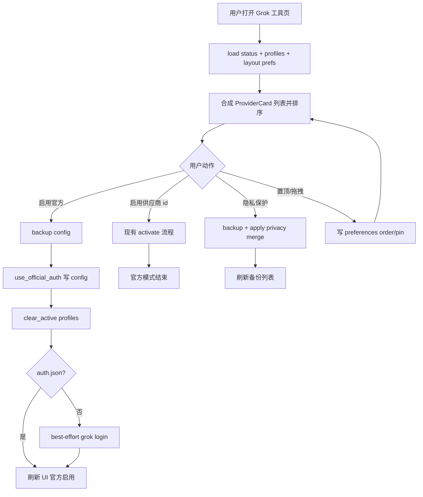

# extend-grok-providers-tool 设计文档

## 0. 术语约定

| 术语 | 定义 | 防冲突结论 |
|---|---|---|
| 官方账号模式 | 清除 config.toml 中由供应商档案写入的 API 覆盖，让 Grok CLI 回退使用 `~/.grok/auth.json`（`grok login` OAuth） | 新名词；不是「无供应商列表」，也不是删除 profiles |
| API 供应商模式 | 启用某个 `GrokProfile`，把 Base URL / Key / 模型写入 config.toml | 复用现有 `activate` 语义 |
| 登录方式卡片 | 首页统一展示的「官方账号」卡 + 各 API 供应商卡 | 前端展示单元；官方卡没有 profile id |
| 卡片键 providerKey | 稳定标识：官方固定 `official`；供应商 `profile:{id}` | 仅用于排序/置顶偏好，不写入 profiles.json |
| 隐私保护配置 | 向 config.toml 合并固定的 telemetry / harness 键值，其它段尽量保留 | 本地配置动作，≠ 账号侧 data sharing |
| 配置漂移 | 有 active profile 时，磁盘 config 与档案内容不一致 | 复用现有 `configMatchesActive`；官方模式下不适用 |

### 术语守护

- 不把「官方账号」叫成「Default 供应商」或「空 profile」。
- 不把「清除 API 覆盖」说成「删除 config.toml」或「删除 auth.json」。
- 不把隐私保护按钮说成「开启账号隐私模式 /privacy」。

---

## 1. 决策与约束

### 需求摘要

用户目标：Session Launcher 已融合的 Grok 供应商工具页，补齐上游 grok-build-switch **v0.2.0** 的三类能力——官方账号切换、隐私保护写入、卡片排序/置顶——在本 app 内闭环完成登录方式管理。

核心行为：

1. **官方账号切换**：用户启用「官方账号」→ 备份 config → 清除供应商拥有的 API 覆盖 → 清除所有 profile 的 `isActive` → status 显示官方模式；若缺少 `auth.json` 则提示需 `grok login`，并 best-effort 启动 `grok login`。
2. **API 供应商切换**：行为与现网一致（备份 + apply profile + set_active）；启用后官方模式结束。
3. **隐私保护**：用户触发后备份 config，合并固定隐私键值，保留其它段；不改变当前 active / 官方模式。
4. **卡片布局**：官方卡 + 供应商卡可置顶、可拖动排序；顺序与置顶写入本机偏好，刷新/重启后保留；搜索仍可过滤。

成功标准：

- 启用官方账号后：`profiles.json` 中无 `isActive=true`；config 中无 `models_base_url` / `models.default|web_search` / `subagents.default_model` / `[model]` / `[model.*]` 供应商段；非供应商段（如 `[cli]`）仍在。
- 再启用任一 API 供应商后：config 再次写入该档案上游，且该档案 `isActive=true`。
- 隐私保护后：config 含约定键值（见 2.1）；其它段不被整文件重写抹掉。
- 置顶与排序在重启 app 后仍生效；删除供应商后无效 `providerKey` 被忽略/清洗。
- `cd src-tauri && cargo test --lib` 与 `pnpm build` 通过。

明确不做：

- 不做系统托盘、开机自启、本地 HTTP 管理面（grok_switch 宿主能力）。
- 不做 HTTP 拉模型列表 / 连接探测（v0.1 已声明未移植，本轮仍不做）。
- 不做完整 config.toml 可视化编辑器。
- 不删除 `profiles.json` 档案、不删除 `auth.json`、不修改 session 扫描/删除/终端 launch。
- 不实现账号侧 Coding data sharing 或 `/privacy` 会话模式（仅文档/文案可提示用户去 Grok 内设置）。
- 不引入新 npm 拖拽库；用原生 HTML5 DnD 或等价轻量实现。
- 不把 API Key 明文展示策略升级为本轮范围（保持现有 mask）。

### 假设

- 假设：官方模式的判定是「没有任何 profile `isActive`」，与 grok-build-switch 的 `active.ID == ""` 一致；config 是否已清干净用独立字段/操作结果表达，不要求「无 active 即 config 一定干净」（用户可能手改文件、还原备份、手改磁盘）。
- 假设：`auth.json` 路径 = **`GROK_HOME` 解析目录下的 `auth.json`**（默认 `~/.grok/auth.json`）。`GROK_CONFIG` 只覆盖 config 文件路径，**不改变** auth 路径。存在即 `officialLoggedIn=true`；不解析 token 是否过期。
- 假设：缺少 `auth.json` 时 **best-effort** 后台启动 `grok login`（固定 argv，无用户可控参数；实现可 prepend `~/.grok/bin` 到子进程 PATH，仍不扩展 launcher wrapper）。启动失败不回滚已完成的 config 清理与 `clear_active`，只在 **Ok** 结果里带 `loginRequired=true` 与提示文案。
- 假设：排序/置顶存在 **app 偏好 `preferences.json`**，经 **Tauri command** 读写（与 favorites 相同模式；前端无 plugin-store 直连）。不写入 `~/.grok_switch/settings.json`。
- 假设：拖动排序仅在同「置顶分组」内交换（置顶区与非置顶区互不跨拖），与源 WebUI 一致。
- 假设：现网 `ensure_default_profile`（profiles 空且 config 存在时导入 Default 并 active）**本轮保留**。纯 OAuth 用户首次打开可能看到 Default 为 active、`officialActive=false`；官方卡始终可见，用户一点「启用官方」即可进入官方模式。不在本 feature 改导入-active 策略（避免扩大回归）。

### 复杂度档位

走本地桌面工具默认档位，有一处偏离：

- 安全性 = validated（偏离 trusted）：改写用户 `config.toml` 与可能 spawn `grok login`，必须先备份、路径仍受 `GROK_HOME`/`GROK_CONFIG` 约束、备份文件名校验沿用现逻辑。

### 关键决策

1. **能力落在现有 `grok_provider` 模块扩展，不新建平行子系统**  
   官方切换与隐私保护都是「config 文本变换 + switcher 编排」，与 `apply_profile_text` 同层；UI 仍在 Grok 工具页 `ProvidersWorkspace`。

2. **官方切换 = 清除供应商拥有字段，不是写入「官方 profile」**  
   不把官方账号存进 `profiles.json`；避免档案与 OAuth 凭据混存。

3. **布局偏好走 app `preferences.json`，卡片键用稳定 providerKey**  
   与 favorite_project_dirs 同类；键 `official` / `profile:{id}` 可跨刷新引用。

4. **隐私保护是独立命令，不绑定某个 profile**  
   工具栏全局动作即可；编辑弹层可再挂入口，语义相同。

5. **不移植托盘级联菜单**  
   Session Launcher 无托盘；官方入口以首页固定卡片表达。

### 方案深度 pre-pass

| 候选 | 说明 | 取舍 |
|---|---|---|
| A. 完整对齐 v0.2.0 产品能力（官方/隐私/排序置顶），宿主仍为 Tauri 页 | 用户「都做」的直接含义 | **采用** |
| B. 只做官方切换 | 缺隐私与布局 | 用户明确要求都做 → 拒 |
| C. 外链打开 grok_switch WebUI | 非融合，且 macOS 未必装 | 拒 |
| D. 排序用第三方 dnd 库 | 增加依赖 | 拒；原生 DnD 足够 |

转正条件：无（本轮即为目标闭环，不设「假实现」占位）。

### Top 3 风险

1. **config 行级清理误删用户手写段**  
   缓解：只删供应商拥有键/段（与源 `UseOfficialAuthText` 同清单）；单测用含 `[cli]` 等保留段的 fixture。
2. **`grok login` spawn 在 app 进程 PATH 失败**  
   缓解：失败不阻断清理；UI 明确展示「请在终端执行 grok login」；wrapper PATH 策略本轮不扩展（login 非 resume）。
3. **布局偏好残留已删 profile 的 key**  
   缓解：渲染前按当前 profiles 清洗 order/pin；保存时只写现存键 + `official`。

### 非显然依赖

- 本机可能不存在 `~/.grok/config.toml` 或 `auth.json`：官方切换仍应能创建/写出清理后的 config（或对空文件 no-op 写出）。
- 用户若同时使用 Windows grok_switch 与本 app 共享 `profiles.json`：active 标志互通；排序偏好不互通（已声明）。

### 关键假设（供用户改）

- 布局存在 app 偏好而非 `~/.grok_switch/settings.json`。
- 缺 auth 时 best-effort 启动 `grok login`。
- 拖动不跨置顶边界。

### 必跑验证命令

| 命令 | 用途 | 基线风险 |
|---|---|---|
| `cd src-tauri && cargo test --lib` | 官方清理 / 隐私合并 / activate 回归 | 当前应绿；预检若红先归因 |
| `pnpm build` | 前端类型与契约 | 当前应绿 |

### 交付物清单

- 后端：官方激活、隐私保护、status 扩展字段、store `clear_active`、config 文本变换与单测。
- 前端：官方卡、启用官方、隐私按钮、置顶/拖拽、偏好读写。
- 偏好 key：`grok_provider_order`、`grok_pinned_provider_ids`。
- 文档：architecture 中 Grok 工具页能力补一句；用户文档可选短补。
- CodeStable：本 design / checklist / 后续 review·QA·acceptance。

### 清洁度规则

- 禁止 `console.log` / `dbg!` / 临时 TODO·FIXME 作为提交内容。
- 禁止注释掉的整段死代码。
- 禁止无用 import。
- 例外：无（隐私/官方相关日志不新增）。

### 基线风险

实现前预检上述两命令；若红灯属既有问题，在 step 证据中标注「非本 feature 引入」再继续。

---

## 2. 名词与编排

### 2.1 名词层

#### 现状

| 概念 | 职责 | 位置 |
|---|---|---|
| `GrokProfile` | API 供应商档案 | `src-tauri/src/grok_provider/profile.rs` |
| `GrokProviderStatus` | `activeProfile` / `configPath` / `dataDir` / `configMatchesActive` / `configExists` | 同上 |
| `apply_profile_text` | 按 profile 重写 endpoints/models/subagents/model.* | `config.rs` |
| `GrokSwitcher::activate` | 备份 → apply → set_active | `switcher.rs` |
| `ProfileStore` | CRUD + `set_active`；**无** `clear_active` | `store.rs` |
| Tauri 命令 | status/list/create/update/delete/activate/import/backups | `commands.rs` / `mod.rs` |
| 前端 | `ProvidersWorkspace` 只渲染 profiles；`useGrokProviders` 调现有 invoke | `src/components/`、`src/hooks/`、`src/types.ts` |
| 偏好 | 终端/主题/收藏等；**无** Grok 布局 key | `preferences.rs` |

#### 变化

| 动作 | 变化 | 动机 |
|---|---|---|
| 扩展 | `GrokProviderStatus` 增加 `officialActive: bool`、`officialLoggedIn: bool` | UI 渲染官方卡状态 |
| 新增类型 | `GrokActivateOfficialResult { loginRequired, message }`（camelCase） | 区分「已切官方」与「还需 login」；**仅 Ok 路径** |
| 新增类型 | `GrokPrivacyResult { path, message }`（camelCase） | 隐私写入反馈 |
| 新增类型 | `GrokProviderLayout { order: string[], pinnedIds: string[] }` | 布局读写契约 |
| 新增变换 | `use_official_auth_text`：删除供应商拥有赋值与 `[model]`/`[model.*]` 段 | 官方模式核心 |
| 新增变换 | `apply_privacy_protection_text`：merge 固定键（常量清单） | 隐私能力 |
| 扩展 store | `clear_active()`：全部 `isActive=false` | 官方模式档案侧 |
| 新增偏好 key | `grok_provider_order`、`grok_pinned_provider_ids` | 布局持久化 |
| 新增命令 | 见下方接口示例与挂载点 | 前端无 store SDK，必须走 command |
| 前端类型 | 对齐上述；展示模型 `ProviderCard`（kind: official \| profile） | 统一列表 |

#### 接口示例

**1）`grok_activate_official` → `Result<GrokActivateOfficialResult, String>`**

```text
输入：无
成功 Ok（config 已清理 + clear_active 已提交）：
  loginRequired: bool   // !auth_path.exists()
  message: string       // 人读提示；spawn 失败时含「请在终端执行 grok login」
副作用：
  - config 存在则先 backup；不存在则跳过 backup，仍写出清理后文本（可为空文件规则后的结果）
  - 写 config（use_official_auth）
  - clear_active
  - 若 !auth 存在：best-effort Command::new("grok").arg("login")；失败不改 Ok/Err 分界
失败 Err(String)：
  - backup 失败（文件存在但不可读/不可写备份目录）
  - 写 config 失败
  - clear_active 失败（此时 config 可能已变：message 要求用户重试「启用官方」；不把状态标为成功）
// 来源扩展：GrokSwitcher + commands
```

**2）`grok_apply_privacy_protection` → `Result<GrokPrivacyResult, String>`**

```text
输入：无
成功 Ok：
  path: config 路径
  message: 提示已写入
副作用：
  - config 存在则 backup；不存在视为空文本，merge 后创建写出（仍可产生「仅隐私键」的 config）
  - 不改变任何 profile.isActive / 官方模式
失败 Err：读失败（存在但不可读）/ 写失败 / backup 失败
// 来源扩展：config 变换 + switcher
```

隐私固定键（实现用常量，单测黄金串）：

```toml
[features]
telemetry = false

[telemetry]
trace_upload = false
mixpanel_enabled = false

[harness]
disable_codebase_upload = true
```

**3）布局偏好命令（与 favorites 同模式）**

```text
get_grok_provider_layout() -> GrokProviderLayout
set_grok_provider_layout(layout: GrokProviderLayout) -> GrokProviderLayout

GrokProviderLayout {
  order: string[]      // providerKey 列表
  pinnedIds: string[]  // 置顶 providerKey
}

sanitize（load 与 save 均做）：
  - 去空、去重（保序）
  - set 时实现可只做格式清洗；渲染时再按「当前 profiles + official」过滤死 key
  - 不进 AppState；Grok 页按需 load/save
// 来源扩展：preferences.rs + commands.rs
```

**4）卡片排序算法（`buildProviderCards` 锁定）**

```text
keys 候选 = ["official"] + profiles.map(p => `profile:${p.id}`)
有效 order =
  1) 取 preferences.order 中仍属于候选的 key（保序）
  2) 将未出现的候选按默认规则追加：
     - 若 official 尚未出现 → 插到结果最前
     - 其余缺失的 profile key 按 profiles 原数组顺序追加
pinned = preferences.pinnedIds ∩ 候选
排序：先 pinned=true，再按有效 order 下标；同 pin 组内稳定
拖拽：仅当 source 与 target 的 pinned 标志相同才允许 drop
```

**5）status（变更后）**

```text
activeProfile: null | profile
officialActive: 没有任何 profile.isActive   // 固定语义，不看 config 是否干净
officialLoggedIn: auth_path.exists()
configMatchesActive: 有 activeProfile 且 config 存在时比较；否则固定 false
configExists / configPath / dataDir: 保持
// 来源：GrokProviderStatus
```

官方卡 UI（示意）：

```text
名称：官方账号
副标题：grok.com / auth.json
元信息：已登录 | 尚未登录 · OAuth 官方模型
搜索匹配：名称「官方账号」、副标题 auth.json / grok.com
操作：启用 | 置顶；无编辑/删除/复制
busyId 约定：官方操作用 "official"；隐私用 "privacy"；其余沿用 profile id / import / backup file
```

#### Interface 设计检查

- **Module**：仍在 `grok_provider`；preferences 仅增 key。
- **Depth**：调用方（前端）只 invoke 命令，不拼 TOML。
- **Seam**：config 文本变换保持纯函数 + 文件 IO 包装，便于单测。
- **不新增**跨进程 HTTP adapter。

---

### 2.2 编排层

#### 主流程图



#### 现状

线性命令：list / activate(id) / CRUD / import / restore。无官方支线；无布局状态。

#### 变化

- 增加支线 **ActivateOfficial** 与 **ApplyPrivacy**。
- 前端列表从「纯 profiles」变为「官方卡 + profiles」合成排序。
- 拓扑：仍为请求-响应；无后台状态机。

#### 流程级约束

| 约束 | 说明 |
|---|---|
| 错误语义 | backup/写盘/clear_active 任一步失败 → `Err`；前端不 toast 成功。login spawn 失败 → 仍 `Ok` + loginRequired |
| 半成功 | 若写 config 已成功而 clear_active 失败：返回 `Err`，提示重试启用官方；不返回 Ok（避免徽章假成功） |
| 无 config 文件 | 官方/隐私均跳过 backup，对空文本变换后写出 |
| 官方成功后 | login spawn 失败不撤销清理与 clear_active |
| 幂等 | 重复启用官方：再次清理 + clear_active，可再产生备份 |
| 隐私幂等 | 重复应用得到相同键值；不改 active |
| 并发 | 继续用现有 `Mutex<GrokSwitcher>`；偏好走 plugin-store 既有路径 |
| 顺序 | 官方：backup(若存在) → 写 config → clear_active → optional login |
| 可观测 | 前端 status 文案 + toast；不新增日志文件 |
| restore_backup | 仍不改 isActive（现网）；还原后徽章可能与磁盘漂移，用户需再点启用（本轮不自动纠偏） |

---

### 2.3 挂载点清单

1. **Tauri 命令注册**（`commands.rs` + `lib.rs`）：  
   - `grok_activate_official`  
   - `grok_apply_privacy_protection`  
   - `get_grok_provider_layout` / `set_grok_provider_layout`  
   - 既有 `grok_provider_status` 返回字段扩展  
2. **偏好 key**：`preferences.json` → `grok_provider_order`、`grok_pinned_provider_ids`（经 preferences.rs load/save）。  
3. **Grok 工具页 UI 注入**：`ProvidersWorkspace`（及卡片列表子结构）— 官方卡、隐私按钮、置顶/拖拽。  
4. **前端类型契约**：`src/types.ts` — Status / ActivateOfficialResult / PrivacyResult / Layout。

（architecture / user 文档更新归第 4 节；AGENTS.md 偏好 key 列表本轮可选同步，不阻塞验收。）

---

### 2.4 推进策略

1. **结构准备**：`buildProviderCards` 纯函数（排序算法按 §2.1）落到 `src/lib/grokProviderCards.ts`  
   退出：仓库若无 vitest，则导出函数 + 同文件注释用例表（≥3 组输入输出）+ `pnpm build`；有测试基建则单测覆盖默认序/置顶/死 key。
2. **后端 config 变换**：官方清理 + 隐私 merge + 单测（含无初始文件、保留 `[cli]`）  
   退出：相关 `cargo test` 断言通过。
3. **store/switcher/status + Tauri 命令**：clear_active、activate_official、privacy、layout get/set、status 字段  
   退出：官方激活后再启用供应商单测；无 auth → loginRequired；`cargo test --lib` 全绿。
4. **前端 hook/types**：接入新 invoke；busyId 含 official/privacy  
   退出：`pnpm build` 通过。
5. **UI 闭环**：官方卡、隐私、置顶/拖拽、搜索、空 profiles 仍显示官方卡  
   退出：手工完成 S1/S2/S4/S5/S6/S11。
6. **harden + 文档**：死 key 清洗；architecture 补 `grok_provider` 与三能力；user 文档短补  
   退出：反向核对无托盘/HTTP 管理面；CMD-001/002 通过。

### 证据类型

| 场景类 | 证据 |
|---|---|
| config 变换 | Rust 单测字符串断言 |
| 激活编排 | Rust 单测临时目录 |
| 前端契约 | `pnpm build` |
| UI 布局/官方卡 | 手工 smoke / 可选截图 |
| 偏好持久化 | 改后重启或再 load 观察 |

---

### 2.5 结构健康度与微重构

##### 评估

- 文件级 — `config.rs`（~404 行）：职责是 config 文本变换，本轮再增两套变换，接近 500 行阈值；概念仍同域。
- 文件级 — `ProvidersWorkspace.tsx`（~319 行）：将增官方卡、DnD、置顶，改动密度高，易混「列表/表单/备份」。
- 文件级 — `App.tsx`（~604 行）：应只薄传 props/回调，避免把布局逻辑塞进 App。
- 目录级 — `grok_provider/`：5 个文件，健康；不新增大目录。
- 目录级 — `src/components/`：可再增小组件文件，未达摊平阈值。

compound 检索：无「providers 目录归属」convention；favorites 偏好模式可参考 quick-session-access。

##### 结论：微重构（拆文件）— 仅前端展示，可选但推荐作为 step 0

- 搬什么：从 `ProvidersWorkspace` 抽出「卡片列表（含官方卡/拖拽/置顶）」与可选「编辑表单」为同目录小组件，或至少抽出纯函数 `buildProviderCards(status, profiles, order, pinned)` 到 `src/lib/`。
- 搬到哪：`src/lib/grokProviderCards.ts`（纯函数，优先）+ 必要时 `ProviderCardList.tsx`。
- 行为不变验证：先抽纯函数与现网列表渲染一致（无官方卡时顺序=profiles 原序）+ `pnpm build`。
- 若时间紧：**允许**在 2.5 选「不做」而把抽函数并进 UI step——但 design 倾向 **先抽纯函数再加官方卡**，降低 `ProvidersWorkspace` 继续膨胀。

本 design **锁定**：checklist 第 1 步做「卡片合成纯函数落地（可先无 DnD）」，属结构准备 + 为官方卡铺路，不是无关重构。

##### 超出范围的观察

- `App.tsx` 仍偏胖；本 feature 禁止借机大拆 sessions/ports 编排 → 后续 `cs-refactor`。

---

## 3. 验收契约

### 3.1 关键场景清单

| ID | 输入/触发 | 期望可观察结果 |
|---|---|---|
| S1 | 有 active API 供应商且 config 存在时点「官方账号 → 启用」 | 无 profile isActive；config 无供应商拥有字段；status.officialActive=true；产生备份 |
| S2 | 无 auth.json 时启用官方 | Ok.loginRequired=true；UI 提示需 login；config 已清理且 clear_active |
| S3 | 有 auth.json 时启用官方 | officialLoggedIn=true；loginRequired=false |
| S4 | 官方模式下启用某 API 供应商 | 该 profile active；config 写回上游；officialActive=false |
| S5 | 点隐私保护（config 已存在） | 备份 + 三组键值存在；其它段如 `[cli]` 仍在 |
| S5b | 无 config 时点隐私保护 | 创建 config 且含隐私键；不因「无法备份」失败 |
| S6 | 置顶官方卡后刷新/重开工具页 | 官方卡仍在置顶区 |
| S7 | 同分组内拖拽两供应商调序后重启偏好 | 顺序保持 |
| S8 | 搜索「官方」 | 官方卡可见；不匹配的供应商隐藏 |
| S9 | 删除已排序中的供应商 | 列表不再引用死 key；不崩溃 |
| S10 | 启用官方时 backup 失败（config 存在但备份写失败） | Err toast；不返回 Ok（不假装官方已启用） |
| S11 | 空 profiles + 官方卡 | 不再显示「还没有供应商」空态挡死；至少可见官方卡 |
| S12 | 无 config 时启用官方 | 跳过 backup；写出清理后 config；clear_active；不因「无法备份」失败 |

### 3.2 明确不做反向核对

- 代码中不新增系统托盘 / `systray` / 开机自启注册。
- 不新增本地 HTTP listen 管理 API（非 Tauri command）。
- 不调用账号云端 privacy API。
- 不在前端展示完整未 mask 的 API Key（保持 mask）。
- 不修改 session scanner / launcher 白名单语义。

### 3.3 Acceptance Coverage Matrix

| Scenario | Covered By Step | Evidence Type | Command / Action | Core? |
|---|---|---|---|---|
| S1 官方切换清理 | step-2 / step-3 | test | `cargo test --lib` | yes |
| S2 loginRequired | step-3 | test | tempdir 无 auth → loginRequired | yes |
| S3 已登录 | step-3 | test | touch auth.json | yes |
| S4 回到 API | step-3 | test | `cargo test --lib` | yes |
| S5 / S5b 隐私 | step-2 / step-3 | test | 有/无初始 config | yes |
| S6–S7 布局 | step-4 / step-5 | manual / 偏好 | 重启工具页 | yes |
| S8 搜索 | step-5 | manual | 输入搜索 | no |
| S9 死 key | step-1 / step-5 | 纯函数用例 + manual | 删除供应商 | no |
| S10 备份失败 | step-3 | test 或可控 IO mock | 失败路径 | yes |
| S11 空态 | step-5 | manual | 空 profiles | yes |
| S12 无 config 官方 | step-2 / step-3 | test | 无初始 config | yes |

### 3.4 DoD Contract

| ID | 要求 | 证据 | 阻塞级别 |
|---|---|---|---|
| DOD-DESIGN-001 | design/checklist 可执行且 review passed | design-review | blocking |
| DOD-IMPL-001 | checklist steps 完成 | checklist + diff | blocking |
| DOD-REVIEW-001 | code review passed | review 报告 | blocking |
| DOD-QA-001 | 核心场景 + 必跑命令 | QA 报告 | blocking |
| DOD-ACCEPT-001 | 用户/验收按矩阵核对 | acceptance | blocking |

### 3.5 UI polish（适用）

- 加载中：原有 loading 保留。
- 官方已启用：启用按钮 disabled +「启用中」徽章。
- 错误：toast/status，不静默。
- 长名称：卡片截断不撑破布局。
- 键盘：拖拽以鼠标为主；置顶按钮可点击；不强制键盘重排。
- 对比度：徽章/置顶标记沿用现有 providers 样式 token。

### 3.6 Harden

- 备份文件名还原仍只允许 basename `.toml`。
- 偏好数组去重、去空；**渲染/合成列表时**只保留已知 providerKey（set 可只做格式清洗）。
- spawn `grok login` 不传入用户可控参数（固定 argv）。
- 不通过 shell 拼接 session 数据（本 feature 不触 launcher）。

---

## 4. 与项目级架构文档的关系

当前 architecture 仍偏「Session/Port 双工具页」，且模块树可能未列 `grok_provider/`（代码与用户文档已有 Grok 页）。本 feature 实现收尾时 **至少** 回写：

1. 工具页：Sessions / Ports / **Grok（供应商）**。
2. 模块：`src-tauri/src/grok_provider/` + `GrokProviderState`；数据目录 `~/.grok_switch`；生效配置 `~/.grok/config.toml`。
3. 能力句：官方账号模式与 API 供应商切换；隐私保护本地配置；卡片顺序/置顶为 app 偏好（非 profiles）。

不改变 session 扫描五 CLI 架构与 launch 安全模型。  
`docs/user/session-launcher.md` 短补三能力关键句。  
`AGENTS.md` 偏好 key 列表：本轮可选同步，不阻塞 acceptance。

---

## 自我批判（交稿前）

1. **可证伪性**：S1–S5 可用单测/文件内容 yes-no；S6–S7 靠偏好持久化观察。
2. **步骤原子性**：config 变换与编排分步；UI 与偏好分步。
3. **最弱依赖**：config 行级解析与现 `apply_profile_text` 风格一致，误删风险用单测锁清单。
4. **证据**：核心路径强制 `cargo test`；UI 核心靠手工 smoke。
5. **基线命令**：已写。
6. **交付物**：命令/偏好 key/UI/文档可核验。
7. **清洁度**：已写。
8. **接口深度**：前端仍只 invoke，不碰 TOML。
