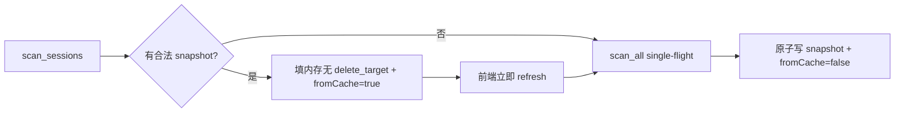

# scan-cache-and-metrics 设计文档


## 0. 术语约定

| 术语 | 定义 | 防冲突 |
|---|---|---|
| scan cache | `{app_data}/scan-cache-v1.json` 磁盘快照 | 非云同步 |
| fromCache | ScanResponse 标记本次来自磁盘 | 新字段 |
| ops_ready | 内存 sessions 含 delete_target 的 full scan 完成态 | 内部语义 |

## 1. 决策与约束

### 需求摘要
冷启动有合法 snapshot 时立即返回列表（fromCache=true），前端同流程立即 refresh_sessions；full scan 写回 snapshot 并带 scanDurationMs。缓存窗内需 delete_target 的删除明确失败。

### 明确不做
- fs watcher / 独立 background worker / event bus
- 缓存文件写入 delete_target
- Windows 路径特例

### 关键决策
1. 缓存路径锁定 app data `scan-cache-v1.json`
2. 前端：`fromCache===true` → 立即 `refresh_sessions()`
3. single-flight full scan

### 必跑命令
`cargo test --lib`；`pnpm build`

## 2. 名词与编排

### 2.1 名词层
**现状**：`cached_scan` 未 scanned 时同步 `scan_all`；`ScanResponse` 仅 sessions+scanErrors；`delete_target` serde skip。
**变化**：扩展 ScanResponse；磁盘 snapshot；cached_scan 优先读盘并填内存；scan_all 写盘。

```
ScanResponse { sessions, scanErrors, fromCache?: bool, scanDurationMs?: number }

ScanCacheSnapshot {
  version: u32,           // 当前 1；不匹配忽略
  saved_at: ISO8601,
  sessions: Session[],    // 仅可序列化字段；永不含 delete_target
  scan_errors: CliScanError[],
  total_ms: number
}
```

**缓存命中必须**：`read snapshot → 写入 AppState.sessions（delete_target=None）→ 标记已展示/scanned 展示态 → 返回 fromCache=true`。  
ops 未就绪直至 full scan 完成把带 delete_target 的 sessions 写回内存。

### 2.2 编排层


**流程约束**：
- 缓存窗：依赖 `delete_target` 的 CLI（Codex/Claude 文件、Cursor/Grok 目录）delete → Err「请刷新」；OpenCode 按 session_id 可删但仍建议 refresh
- full scan **single-flight**（同进程二次 refresh 等待同一次结果）
- snapshot **atomic write**（temp + rename）

### 2.3 挂载点
1. `ScanResponse` 模型 + 前端 types
2. `AppState::cached_scan` / `scan_all`
3. `useSessions` 启动链：fromCache 后 refresh
4. 状态栏展示 fromCache/耗时

### 2.4 推进策略
1. 模型字段 + 缓存读写纯函数/单测
2. state 编排 + delete 失败单测
3. 前端启动链 + 状态栏
4. 文档 ARCHITECTURE 一句

### 2.5 结构健康度
- state/mod.rs 可增 scan_cache 子模块若膨胀
- **结论：不做强制微重构**；若 scan_all 再增 >80 行则抽 `state/scan_cache.rs`

## 3. 验收契约
- S1：有 snapshot 时 scan_sessions 不跑五 CLI 完整线程即返回 fromCache=true
- S2：缓存窗 delete（依赖 delete_target 的 CLI）明确失败；OpenCode 例外按 id
- S3：full scan 后 delete 成功且 snapshot 更新
- S4：状态栏可见 fromCache 或 scanDurationMs
- 不做：watcher、缓存含 delete 路径

## 4. 架构关系
更新 ARCHITECTURE：允许本机 scan-cache；session 仍无云同步。

