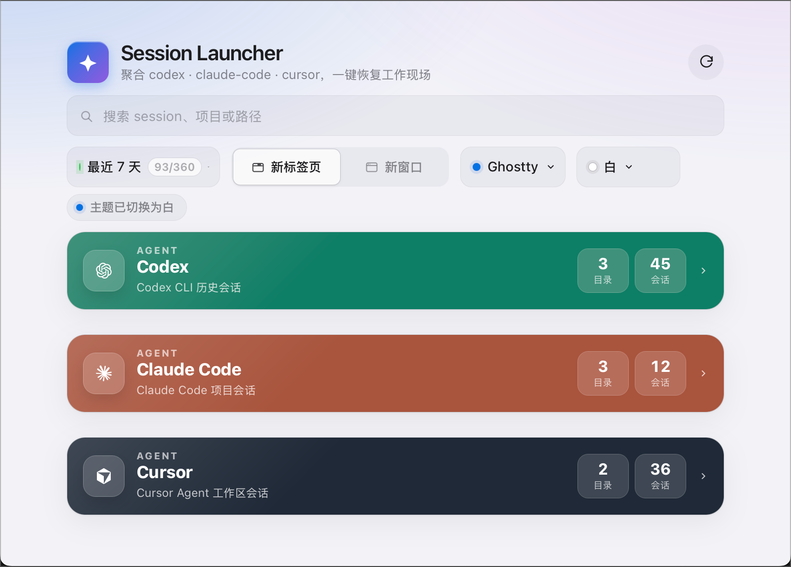

# Session Launcher

[](https://github.com/NanBai/fast-start)

**在 macOS 上统一浏览、搜索并恢复 AI CLI session，同时监控本机开发端口。**



Session Launcher 是一个基于 [Tauri 2](https://tauri.app/) 的桌面应用。你在不同项目里用多种 AI 编程 CLI 时，历史对话散落在各自的数据目录里，很难快速回到「上次做到一半」的那条 session。本应用扫描本机已有的 session 元数据，按 **Agent → 项目目录 → Session** 分组展示，选中后在你习惯的终端里执行对应的 resume 命令，把目录和工作现场一并恢复。它也内置 Port 工具页，用于查看 AI 编码后残留的本机开发服务端口并关闭当前用户进程。

> 仅读取本机数据，不上传、无账号、无云同步。与 OpenAI、Anthropic、Cursor 等公司无隶属关系。

## 它能做什么

- **聚合四类 CLI**：Codex（`~/.codex`）、Claude Code（`~/.claude`）、Cursor Agent（`~/.cursor`）、Grok Build（`~/.grok`）
- **按项目整理**：同一仓库下的多条 session 归在同一项目标题下
- **搜索与筛选**：按项目名、路径、session 摘要、agent 名搜索；可按最近 1～30 天或全部时间范围查看
- **收藏置顶**：按**项目目录**收藏，常用仓库排在前面
- **一键恢复**：在 Terminal.app、iTerm2 或 Ghostty 中**新窗口 / 新标签**启动（resume 时自动 `cd` 到项目目录）
- **本地删除**：右键删除单条 session 的源文件、Cursor chat 目录或 Grok Build session 目录（不删你的项目代码目录）
- **端口监控**：查看本机 TCP/UDP 端口、进程、PID、监听地址和工作目录，可按项目服务/全部端口、协议和关键词过滤
- **关闭服务**：对选中的当前用户端口进程发送 `TERM` 信号，关闭后自动重新扫描
- **主题**：浅色 / 深色 / 跟随系统；窗口支持从窄屏到宽屏的响应式布局

常用快捷键：`Cmd+K` 聚焦当前工具页搜索；在 Session 工具页里，`↑`/`↓` 在结果中移动，`Enter` 启动当前项，`Esc` 清空或失焦搜索框。

## 适合谁用

- 经常在多个仓库之间切换，且混用 Codex CLI、Claude Code、Cursor Agent 的开发者
- 希望用**一个列表**找 session，而不是逐个翻各 CLI 自己的历史
- 希望恢复现场时走**系统终端**（方便多窗格、SSH、自定义 shell 配置）

当前版本面向 **macOS**。Windows / Linux 尚未作为一等目标支持。

## 快速开始（开发）

依赖：macOS、Node.js、pnpm、Rust（Cargo）、Tauri 2 工具链；本机至少一种上述 CLI 的历史 session；至少一个可用终端（Terminal.app / iTerm2 / Ghostty）。

```bash
git clone https://github.com/NanBai/fast-start.git
cd fast-start
pnpm install
pnpm tauri dev
```

验证构建与后端测试：

```bash
pnpm build
cd src-tauri && cargo test --lib
```

打包桌面应用：

```bash
pnpm tauri build
```

更完整的操作说明见 `docs/user/session-launcher.md`；贡献者与发布前检查见 `docs/dev/release-readiness.md`。

## 工作原理（简述）

1. **扫描**：Rust 后端读取各 CLI 在本机的 session 存储（如 Codex/Claude 的 jsonl、Cursor 的元数据与 `store.db`、Grok Build 的 `summary.json`），解析出 session id、项目路径、摘要、时间等。
2. **端口**：Rust 后端通过 `/usr/sbin/lsof` 读取本机 TCP LISTEN 和 UDP 端口，补充进程路径、父进程和工作目录，按本地地址、当前用户和可执行路径识别项目服务。
3. **展示**：React 前端拉取列表后在内存中搜索、排序、收藏；不向 UI 暴露各 CLI 的原始磁盘路径细节。
4. **启动**：根据你选择的终端类型，通过安全校验后的 wrapper / AppleScript 等方式在外部终端执行允许的 resume 程序（`codex`、`claude`、`cursor-agent`、`grok`），并切换到对应 `cwd`。
5. **偏好**：终端选择、启动方式、主题、收藏列表和端口自动刷新保存在本机 `tauri-plugin-store` 中。

## 数据与安全

| 行为 | 说明 |
|------|------|
| 读取 | 仅本机 CLI session 元数据与恢复所需信息 |
| 网络 | 应用本身不依赖联网同步 session |
| 删除 | 只删除该条 session 在 CLI 侧的存储；**不会**删除你的 git 工作区 |
| 启动命令 | 对可执行程序与路径做白名单与校验，避免把 session 内容拼进不可信的 shell |
| 关闭端口 | 前端只传端口记录 id；后端关闭前重新扫描并校验记录未变化，只允许关闭当前用户进程，并使用 `/bin/kill -TERM` |

## 技术栈

- 前端：React 19、TypeScript、Vite 7
- 桌面：Tauri 2、Rust 2021
- 本地存储：rusqlite（扫描 Cursor 等）、tauri-plugin-store（用户偏好）

## 参与贡献

欢迎 Issue 与 Pull Request。改动前端类型或 UI 时请跑 `pnpm build`；改动 Rust 时请跑 `cd src-tauri && cargo test --lib`；涉及启动终端或删除逻辑时请阅读 `src-tauri/src/launcher.rs`、`security.rs`、`session_delete.rs` 相关测试与 `docs/dev/release-readiness.md` 中的 smoke 说明。

## 许可证

本项目采用 [MIT License](LICENSE)。
